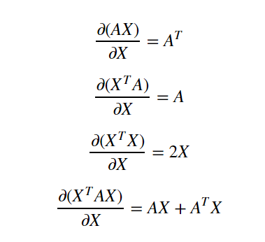

+++
title = "Deep Learning"
date = 2019-05-13T23:44:25-07:00
draft = false

# Authors. Comma separated list, e.g. `["Bob Smith", "David Jones"]`.
authors = ["Prasanna Natarajan"]

# Tags and categories
# For example, use `tags = []` for no tags, or the form `tags = ["A Tag", "Another Tag"]` for one or more tags.
tags = []
categories = []

# Projects (optional).
#   Associate this post with one or more of your projects.
#   Simply enter your project's folder or file name without extension.
#   E.g. `projects = ["deep-learning"]` references 
#   `content/project/deep-learning/index.md`.
#   Otherwise, set `projects = []`.
# projects = ["internal-project"]

# Featured image
# To use, add an image named `featured.jpg/png` to your page's folder. 
[image]
  # Caption (optional)
  caption = "My Notes on Deep Learning"

  # Focal point (optional)
  # Options: Smart, Center, TopLeft, Top, TopRight, Left, Right, BottomLeft, Bottom, BottomRight
  focal_point = "Center"

+++

# Notes: Introduction to Deep Learning

### Table of Contents

1. Basics - Some math before getting started
2. Supervised learning
3. Unsupervised learning

### Pre-Deep Learning (Basics)

#### Linear Models as the simplest Neural Networks 

They are the building block for Neural Networks.

**What's the difference between non machine learning programming and machine learning?**

According to Lawrence Morley (Google AI),

**Non Machine Learning programming (traditional programming):**

**input**: Rules and Data

**output**: Answers

**Machine learning (at least supervised learning):**

**input**: Answers and Data

**output**: Rules

#### Supervised Learning:

**Terminologies (Notations from Introduction to Deep Learning)**
$
x\_i - example \\\\\\ y\_i - target\ value\ (label) \\\\\\ x\_i = (x\_{i1},..,x\_{id}) - features\ (d\ of\ them)\ per\ example \\\\\\ X = ((x\_1,y\_1),(x\_2,y\_2),...,(x\_l,y\_l)) - training\ set \\\\\\ a(x) - model,\ hypothesis,\ function \\\\\\ x->a(x)->y^{pred} \\\\\\ 
$

##### Types

1. **Regression**: Predict Continuous real valued output.
2. **Classification**: The number of target value is finite. Divide the point into a class (from a given set of classes)

#### Linear Regression

Try and fit a line (in d-dimensional space) through the data.
$$
a(x) = b+w\_1x\_1 + w\_2x\_2 + ... + w\_dx\_d = b+ \sum\_{i=1}^{i=d}w\_ix\_i \\\\\\ w\_1,...,w\_d - Coefficients\ (weights) \\\\\\ b - bias\ (can\ also\ be\ interpreted\ as\ w\_0) \\\\\\ d+1\ parameters \\\\\\
$$

We can also think of the same thing in terms of matrices and vector forms

$$
a(x) = w^Tx \\\\\\ where: w = \begin{bmatrix} w\_0\\\\\\ w\_1\\\\.\\\\.\\\\.\\\\\\ w\_d \\\\\\ \end{bmatrix}\ x = \begin{bmatrix} x\_0\\\\\\ x\_1\\\\.\\\\.\\\\.\\\\x\_l \\\\\\ \end{bmatrix} \\\\\\ To\ apply\ the\ above\ to\ a\ new\ sample\ X \\\\\\ a(X) = Xw \\\\\\ where: X = \begin{bmatrix} x\_{11} & ... & x\_{1d} \\\\\\ : & : & : \\\\\\ x\_{l1}& ... & x\_{ld}\\\\\\ \end{bmatrix}
$$
How to know if the line that we come up with is correct? In other words how wrong is the line? What's the **quality of the model**? How do we measure it?

To measure that we calculate the loss function
$$
Mean Squared Error: \\\\\\ 
L(w) = (1/l) \sum_{i=1}^{l}(w^Tx_i - y_i)^2 \\\\\\ \  \ = (1/l)\ ||Xw - y||^2 \\\\\\ where\  (||\ \ ||)\ is\ called\ the\ Eucledian\ Norm
$$
So with the loss function it is easy to **train** the model to make it better by **minimizing** the loss function.

$$
L(w) = (1/l)\ ||Xw - y||^2 -> min_w \ (with\ respect\ to\ w\ ) \\\\\\
Exact\ Solution\ (Analytical)\ for\ w\: \\\\\\
w = (X^TX)^{-1}X^Ty
$$

**Derivation of the analytical solution**

*Some basic derivatives of matrices*

source: <https://towardsdatascience.com/analytical-solution-of-linear-regression-a0e870b038d5>

*Dimensions:*
$X \implies l\*d \\\\\\ y \implies l\*1 \\\\\\ w \implies d\*1 \\\\\\ \\\\\\ $
*Derivation*:
$
L(w) = (1/l) ||Xw-y||^2 \\\\\\
= (1/l) (Xw-y)^T(Xw-y) \\\\\\
= (1/l) ((Xw)^T-y^T)(Xw-y) \\\\\\
= (1/l) ((Xw)^T(Xw) - ((Xw)^Ty) -y^T(Xw) + y^Ty) \\\\\\
$

Since the second term is a scalar (from its dimensions), we can take the transpose of the term
$
= (1/l) (w^TX^TXw - 2y^TXw+y^Ty) \\\\\\
$

Partial differentiation with respect to w, we have:
$
\frac{\partial L(w)}{\partial w} = (1/l) (X^TXw+X^TXw-2X^Ty) \\\\\\
$
Equating it to zero to minimize it:
$
X^TXw = X^Ty \implies w = (X^TX)^{-1} X^Ty
$

Taking inverse of a very high dimension matrix is hard!!!

This can also be seen as solving for a system of linear equations, but that is still computationally hard.

Therefore we need a more generic and scalable learning method.

#### Linear Classification

##### Binary Classification

Implies there are only two classes (only two target values). We basically try to draw a line (in d-dimensional space) to separate the classes.  

