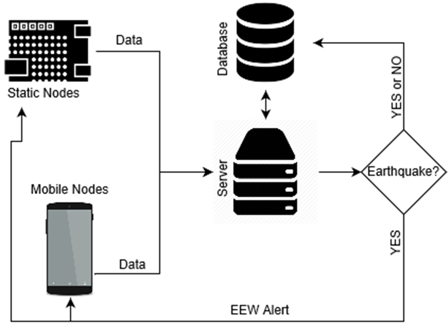
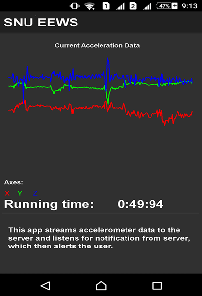

+++
# Project title.
title = "SNU Earthquake Early Warning System"

# Date this page was created.
date = 2016-04-27T00:00:00

# Project summary to display on homepage.
summary = "Crowdsourcing an Earthquake Early Warning System for the Indian Subcontinent (SNU-EEWS)."

# Tags: can be used for filtering projects.
# Example: `tags = ["machine-learning", "deep-learning"]`
tags = ["machine-learning","Android","Web"]

# Optional external URL for project (replaces project detail page).
external_link = ""

# Slides (optional).
#   Associate this project with Markdown slides.
#   Simply enter your slide deck's filename without extension.
#   E.g. `slides = "example-slides"` references 
#   `content/slides/example-slides.md`.
#   Otherwise, set `slides = ""`.
slides = "example-slides"

# Links (optional).
url_pdf = "./SNU_EEWS.pdf"
url_slides = ""
url_video = ""
url_code = ""

# Custom links (optional).
#   Uncomment line below to enable. For multiple links, use the form `[{...}, {...}, {...}]`.
url_custom = [{icon_pack = "fab", icon="twitter", name="Follow", url = "https://twitter.com/georgecushen"}]

# Featured image
# To use, add an image named `featured.jpg/png` to your project's folder. 
[image]
  # Caption (optional)
  caption = "Image by USGS"

  # Focal point (optional)
  # Options: Smart, Center, TopLeft, Top, TopRight, Left, Right, BottomLeft, Bottom, BottomRight
  focal_point = "Center"

+++

# Crowdsourcing an Earthquake Early Warning System for the Indian Subcontinent (SNU-EEWS)

### **Abstract:** 

Earthquakes are potentially very destructive natural events. The risk from earthquakes is aggravated because they are unpredictable and can cause tremendous loss of life and property within seconds, particularly in dense urban settings. We present our ongoing work to develop a comprehensive earthquake early warning system (EEWS) for the Indian subcontinent. The impetus for this work comes from the fact that India has just 82 seismic stations for a land area of about 3.2 million sq. km, with no dedicated EEWS, plus low-cost accelerometers are now easily available, and smartphones have a deep penetration. The planned system will use a network of mobile smart phones and stationary low cost MEMS based strong motion sensors. The main components of this project are: creating a high-density network of low-cost sensors, real-time transmission of data, algorithms to analyze ground shaking data, compute ground motion characteristics, and determine if the source of shaking is an earthquake. 

The proposed SNU - EEW system leverages many enabling technologies to satisfy the anticipated density and cost targets. It can broadly be seen as three different components: 

1. Ground motion data sources using low cost MEMS sensors . 
  - Static – using stationary nodes 
  - Mobile – using smartphones 
2. Algorithms for detecting P-waves & estimating earthquake features. 
3. A central server to poll the sensor network, calculate secondary earthquake features and broadcast warnings.

### **My Contribution**: 

Designed the high level architecture of SNU EEWS. The architecture is shown below. 

Built the android application that reads the accelerometer readings and then:

- Plots the real time accelerometer readings.
- Streams the accelerometer readings to the server in the background.
- Receives alerts from server, if the server detects an earthquake. 

A poster was presented at International conference of Sustainable Infrastructure, New York | October 26-28, 2017. Please find the [paper](./SNU_EEWS final.pdf) and [poster](./SNU_EEWS.pdf) here.